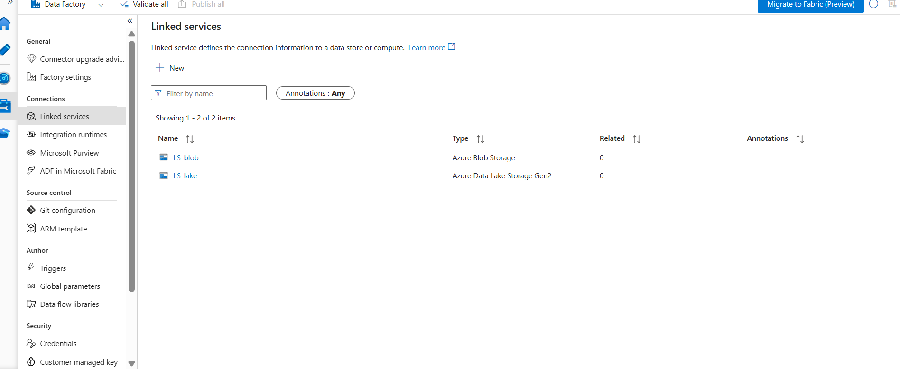
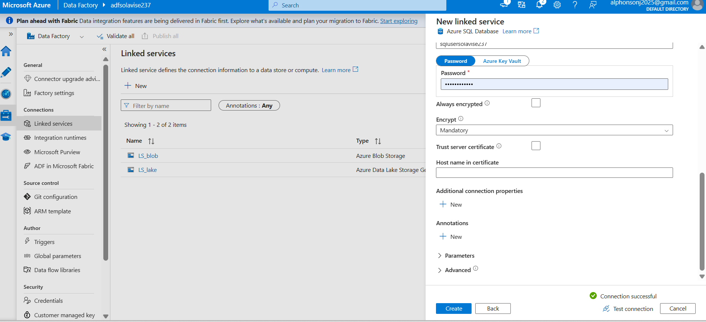
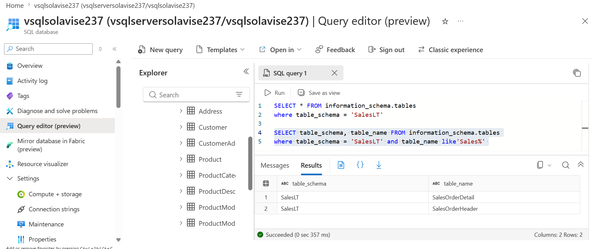
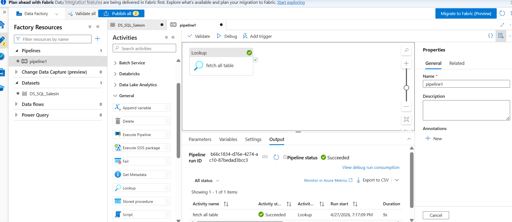
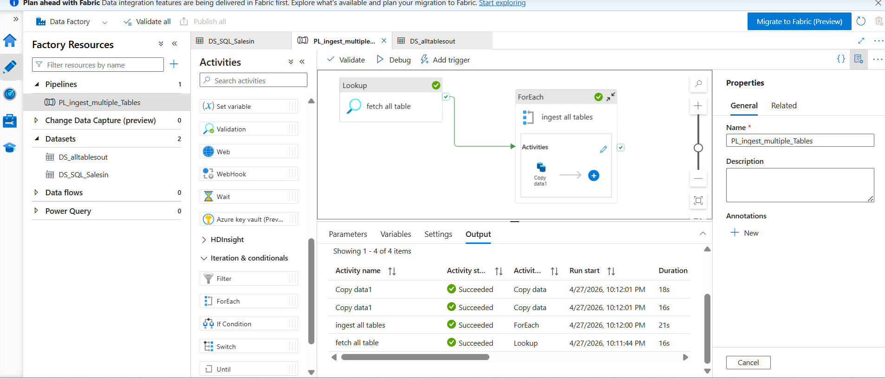

# adf-batch-sequential-data-pipeline
This project demonstrates a production-style data ingestion pipeline built using Azure Data Factory (ADF).
It showcases batch processing, sequential execution, parameterization, and performance optimization using Azure SQL Database as the source and Azure Data Lake as the target.
🔹 Architecture Overview
Azure SQL Database (SalesLT)
        ↓
Azure Data Factory (ADF)
        ↓
Azure Data Lake Storage (ADLS)
        ↓
Logging & Monitoring (SQL)

Batch & Sequential Processing Design
This pipeline was enhanced to support dynamic batch ingestion using parameterization and controlled execution.
⚙️ Key Features
Batch Processing: Multiple tables processed in one pipeline
Sequential Execution: Controlled using ForEach (Batch count = 1)
Dynamic Table Handling: Table names passed as parameters

[
  {"table": "SalesLT.Customer", "folder": "customer"},
  {"table": "SalesLT.Product", "folder": "product"},
  {"table": "SalesLT.SalesOrderHeader", "folder": "salesorder"}
]

ForEach Loop
   ↓
Dynamic Copy Activity
   ↓
SQL → Data Lake (per table)

🔗 Linked Service – Azure SQL Database

We created a secure connection between Azure Data Factory and Azure SQL Database.

Configuration:

- Server: vsqlserversolavise237.database.windows.net
- Database: vsqlsolavise237
- Authentication: SQL Authentication

Result:
Connection tested successfully ✅
 

### 🔍 Dynamic SQL Dataset

The dataset is configured using parameters (`SourceSchema`, `SourceTable`) to enable reusable ingestion logic.

🔹 Step 4: Metadata Lookup (Dynamic Table Ingestion Driver)

To ensure the pipeline is scalable, flexible, and production-ready, a Lookup activity is used as the entry point of the ingestion process.

Instead of hardcoding table names directly in the pipeline, the Lookup dynamically retrieves the list of tables to be processed. This design follows a metadata-driven architecture, which is a standard best practice in modern data engineering.

🔍 Purpose of the Lookup Activity

The Lookup activity is responsible for:

- Fetching table metadata (schema and table names)
- Acting as the control layer for ingestion
- Passing dynamic inputs into the ForEach loop
- Enabling batch processing across multiple tables

🧠 How It Works

The Lookup retrieves a collection of tables, which is then passed downstream:

Lookup → ForEach → Copy Activity → Data Lake

Each table is processed dynamically using:

- "@item().table_name"
- "@item().table_schema"

This allows a single pipeline to handle multiple tables without modification.

💡 Why This Design Matters

- Eliminates hardcoding of table names
- Supports dynamic scaling as new tables are added
- Enables reusable pipeline architecture
- Aligns with real-world enterprise data engineering patterns

📊 Execution Result (Lookup Activity)

The image below shows the successful execution of the Lookup activity, confirming that metadata was retrieved and passed to the pipeline for further processing.

"Lookup Metadata Activity" (images/06_lookup_metadata_activity.png)

07_lookup_metadata_activity.png

ForEach Activity (Dynamic Iteration Engine)
After retrieving table metadata using the Lookup activity, the pipeline leverages a ForEach activity to dynamically iterate through each table and execute the ingestion process.
This enables the pipeline to process multiple tables in a scalable and automated manner, without requiring manual configuration for each dataset.
🔍 Purpose of the ForEach Activity
Iterates through the list of tables returned by the Lookup
Executes ingestion logic for each table
Enables batch or sequential processing
Drives dynamic data movement across multiple datasets
🧠 How It Works
The ForEach activity receives input from the Lookup activity:
Plain text
Lookup Output → ForEach Loop → Copy Activity
Each iteration processes one table using dynamic expressions:
@item().table_name
@item().table_schema
⚙️ Execution Behavior
The ForEach activity supports two execution modes:
Sequential Processing → Batch count = 1
Parallel (Batch) Processing → Batch count > 1
This allows control over performance and execution strategy depending on workload requirements.
📊 Pipeline Flow (Lookup → ForEach → Copy)
The image below illustrates the complete flow of metadata-driven ingestion:
�
💡 Why This Design Matters
Enables dynamic ingestion across multiple tables
Eliminates repetitive pipeline design
Improves scalability and maintainability
Supports performance tuning via parallelism

